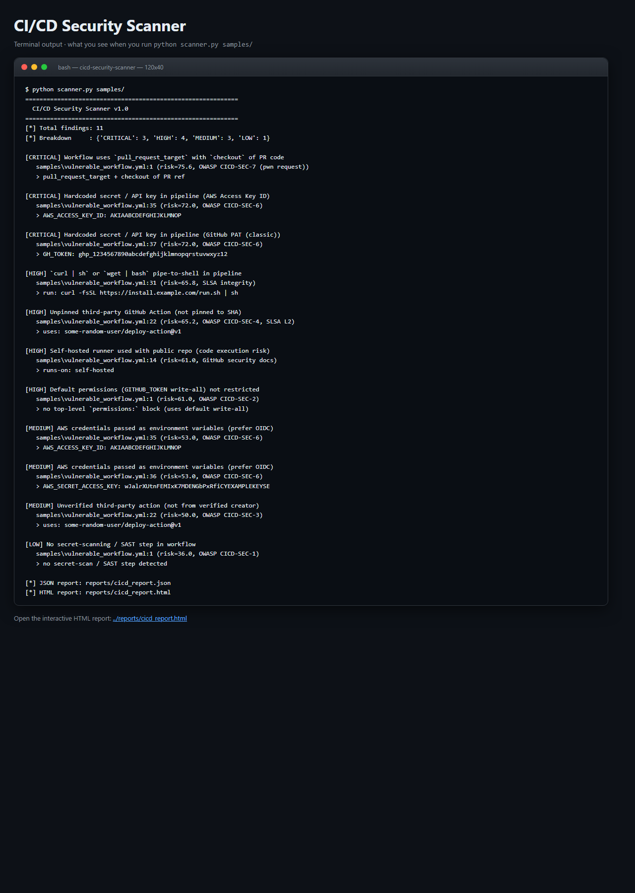
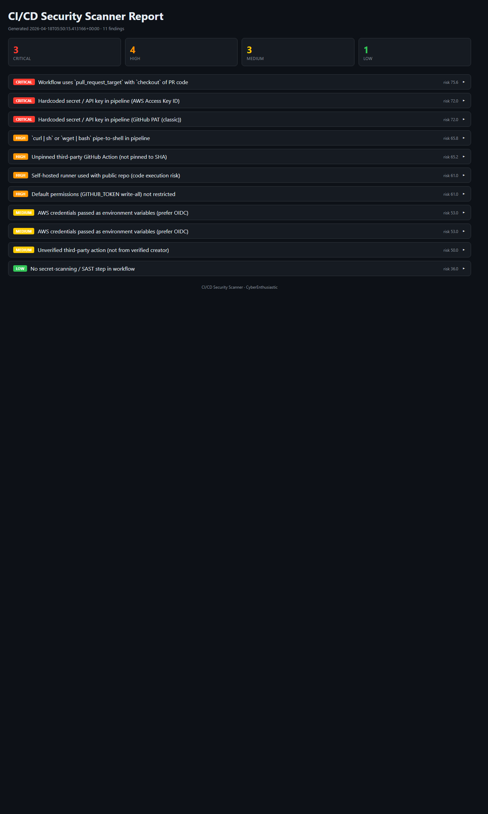

# CI/CD Security Scanner

> **Catch pipeline-level security issues before they ship - OWASP CICD Top 10 mapped, pwn-request aware, zero dependencies.**
> A free, self-hosted alternative to Snyk IaC, Checkov, and StepSecurity for teams that want CI/CD security without the enterprise price tag.

[](./LICENSE)
[](https://www.python.org/downloads/)
[](https://owasp.org/www-project-top-10-ci-cd-security-risks/)

---

## What it does (in one screenshot of terminal output)

```
============================================================
  CI/CD Security Scanner v1.0
============================================================
[*] Total findings: 11
[*] Breakdown     : {'CRITICAL': 3, 'HIGH': 4, 'MEDIUM': 3, 'LOW': 1}

[CRITICAL] Workflow uses `pull_request_target` with `checkout` of PR code
   samples/vulnerable_workflow.yml:1 (risk=75.6, OWASP CICD-SEC-7 (pwn request))

[CRITICAL] Hardcoded secret / API key in pipeline (AWS Access Key ID)
   samples/vulnerable_workflow.yml:35 (risk=72.0, OWASP CICD-SEC-6)
   > AWS_ACCESS_KEY_ID: AKIA...

[HIGH] `curl | sh` or `wget | bash` pipe-to-shell in pipeline
   samples/vulnerable_workflow.yml:31 (risk=65.8, SLSA integrity)
   > run: curl -fsSL https://install.example.com/run.sh | sh
```

And opens this interactive dark-mode HTML report with per-finding drill-down: Severity chip &middot; Rule ID &middot; Risk score &middot; File:line &middot; Snippet &middot; OWASP/SLSA mapping &middot; Remediation.

---

## Screenshots (ran locally, zero setup)

**Terminal output** - exactly what you see on the command line:



**Interactive HTML dashboard** - opens in any browser, dark-mode, filterable:



Both screenshots are captured from a real local run against the bundled `samples/` directory. Reproduce them with the quickstart commands below.

---

## Why you want this

| | **CI/CD Security Scanner** | StepSecurity | Snyk IaC | Checkov |
|---|---|---|---|---|
| **Price** | Free (MIT) | Free tier + $$$$ | Free tier + $$$$ | Free (OSS) |
| **Runtime deps** | **None** - pure stdlib | SaaS | Node + account | Python |
| **OWASP CICD Top 10 coverage** | 10/10 rules | 9/10 | Partial | Partial |
| **Pwn-request detection** | Yes | Yes | No | Limited |
| **Script-injection detector** | Yes | Yes | No | No |
| **Supports GitHub Actions** | Yes | Yes | Yes | Yes |
| **Supports GitLab CI** | Yes | No | Partial | Yes |
| **Supports Jenkinsfile** | Yes | No | Limited | No |
| **Self-hosted / air-gapped** | Yes | No | No | Yes |
| **Interactive HTML report** | Bundled | Dashboard | No | No |

---

## 60-second quickstart

```bash
# 1. Clone
git clone https://github.com/CyberEnthusiastic/cicd-security-scanner.git
cd cicd-security-scanner

# 2. Run it (zero install - pure Python 3.8+ stdlib)
python scanner.py samples/

# 3. Open the HTML report
start reports/cicd_report.html      # Windows
open  reports/cicd_report.html      # macOS
xdg-open reports/cicd_report.html   # Linux
```

### Alternative: one-command installer

```bash
./install.sh        # Linux/Mac/WSL/Git Bash
.\install.ps1       # Windows PowerShell
```

### Alternative: Docker

```bash
docker build -t cicd-scanner .
docker run --rm -v "$PWD/.github:/app/.github" cicd-scanner scanner.py .github/
```

---

## What it detects (12 rule classes)

| ID | Rule | Severity | OWASP / Source |
|----|------|----------|----------------|
| CICD-001 | Unpinned third-party GitHub Action (not pinned to SHA) | HIGH | CICD-SEC-4 / SLSA L2 |
| CICD-002 | Script injection via `${{ github.event.* }}` in run block | CRITICAL | CICD-SEC-7 |
| CICD-003 | Hardcoded secret / API key in pipeline (AWS, GitHub, Slack, OpenAI...) | CRITICAL | CICD-SEC-6 |
| CICD-004 | `pull_request_target` + checkout of PR code (pwn-request) | CRITICAL | CICD-SEC-7 |
| CICD-005 | Default `GITHUB_TOKEN` permissions (write-all) not restricted | HIGH | CICD-SEC-2 |
| CICD-006 | Self-hosted runner used in public repo | HIGH | GitHub docs |
| CICD-007 | Unverified third-party action creator | MEDIUM | CICD-SEC-3 |
| CICD-008 | `curl \| sh` / `wget \| bash` pipe-to-shell | HIGH | SLSA integrity |
| CICD-009 | Docker image pulled without digest (`:latest` or floating tag) | MEDIUM | SLSA integrity |
| CICD-010 | No secret-scanning / SAST step in workflow | LOW | CICD-SEC-1 |
| CICD-011 | AWS credentials passed as env vars (prefer OIDC) | MEDIUM | CICD-SEC-6 |
| CICD-012 | `workflow_dispatch` input interpolated in `run:` block | HIGH | CICD-SEC-7 |

Supports: **GitHub Actions**, **GitLab CI**, **Jenkinsfile**. Partial: CircleCI, Azure Pipelines.

---

## Secret-detection patterns built in

- AWS Access Key (`AKIA...`) + Secret Key
- GitHub PAT classic (`ghp_...`) + fine-grained (`github_pat_...`)
- Slack tokens (`xoxb/xoxp/xoxa...`)
- Google API keys (`AIza...`)
- OpenAI API keys (`sk-...`)
- PEM private-key blocks (RSA/EC/OpenSSH)
- Bearer tokens & hardcoded passwords

---

## Scan your own repo

```bash
# Scan the workflows folder
python scanner.py .github/workflows/

# Scan a single file
python scanner.py .github/workflows/deploy.yml

# Scan the whole repo (walks recursively)
python scanner.py .
```

---

## CI/CD integration (fail PRs on CRITICAL findings)

```yaml
# .github/workflows/pipeline-security.yml
name: CI/CD Security Scan
on: [push, pull_request]
permissions: read-all
jobs:
  scan:
    runs-on: ubuntu-22.04
    steps:
      - uses: actions/checkout@a5ac7e51b41094c92402da3b24376905380afc29
      - uses: actions/setup-python@75f3110429a8c05be0e1bf360334e4cced2b30de
        with: { python-version: "3.12" }
      - name: Run scanner
        run: python scanner.py .github/workflows/
      - name: Fail on CRITICAL
        run: |
          python -c "
          import json, sys
          r = json.load(open('reports/cicd_report.json'))
          if r['summary']['by_severity']['CRITICAL'] > 0:
              sys.exit(1)
          "
```

---

## Extending the rule engine

Add a new rule to `RULES`, then either extend a per-line regex or write a dedicated checker in `scan_github_actions()`:

```python
{
    "id": "CICD-013",
    "name": "Concurrency key missing (deploy race condition)",
    "severity": "LOW",
    "confidence": 0.70,
    "source": "Best practice",
    "remediation": "Add a top-level `concurrency: deploy-${{ github.ref }}` block.",
},
```

---

## Project layout

```
cicd-security-scanner/
|-- scanner.py             # main scanner + 12 rules + secret patterns
|-- report_generator.py    # dark-mode HTML report
|-- samples/
|   |-- vulnerable_workflow.yml
|   `-- good_workflow.yml
|-- reports/               # output (gitignored)
|-- Dockerfile
|-- install.sh / install.ps1
|-- requirements.txt       # empty - pure stdlib
|-- README.md
`-- LICENSE / NOTICE / SECURITY.md / CONTRIBUTING.md
```

---

## Roadmap

- [ ] CircleCI config.yml parser
- [ ] Azure Pipelines YAML parser
- [ ] SBOM / dependency check integration
- [ ] SARIF output for GitHub Code Scanning
- [ ] Git history scan for secrets that were later removed

## License

MIT. See [LICENSE](./LICENSE) and [NOTICE](./NOTICE).

## Security

Responsible disclosure policy: see [SECURITY.md](./SECURITY.md).

---

Built by **[Mohith Vasamsetti (CyberEnthusiastic)](https://github.com/CyberEnthusiastic)** as part of the [AI Security Projects](https://github.com/CyberEnthusiastic?tab=repositories) suite.
